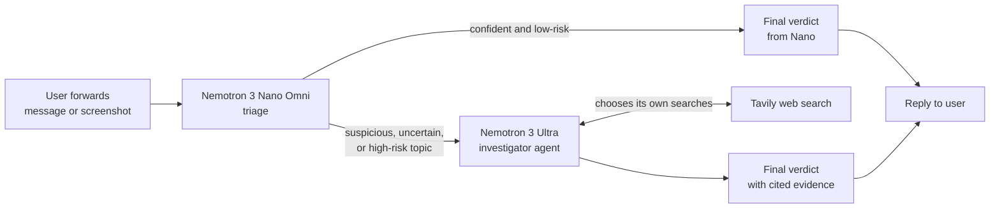
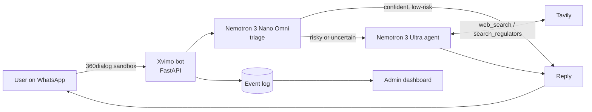

<p align="center">
  
</p>

<p align="center">
  <b>An agentic scam and fraud checker for Africa, built on NVIDIA Nemotron.</b><br>
  Forward a suspicious message. Get a clear verdict, the reasons, and the evidence — before you send money.
</p>

<p align="center">
  
  
  
  
</p>

---

## Milestone 1 — Nano triage layer complete

**Date:** October 2026 · **Hackathon:** Nebius x NVIDIA Global AI Hackathon · **Track:** Best Apps and Agents

This milestone delivers Xvimo's first working layer: a fast triage step that reads any message and decides whether it is safe, a likely scam, or needs a deeper investigation. On our evaluation sample it caught **every scam** and **never gave a wrong answer when deciding alone**.

| Metric (50-message balanced sample) | Result |
|---|---|
| Overall accuracy | **98%** |
| Scams caught (recall) | **100%** (25 / 25) |
| False alarms on legitimate messages | **4%** (1 / 25)* |
| Messages settled by Nano alone | **52%** — with **100%** accuracy |
| Messages sent for deeper investigation | 48% |
| Valid structured output (JSON) | 100% |
| Average latency per check | ~5–8 s |

\* The single false alarm was routed to the investigation layer rather than returned as a final verdict.

> **Honesty note:** the prompt was tuned on this 50-message sample, so these numbers are optimistic. The full 300-message benchmark on unseen data will be run once the complete pipeline is finished, and reported here unchanged.

---

## The problem

Ponzi schemes, fake investment platforms, fake job interviews, loan-app fraud and bank impersonation cost ordinary people in Nigeria and across Africa their savings every year. The people most at risk are not reading regulator circulars or searching company registries — they live on WhatsApp and SMS, and they have seconds to decide whether to pay.

**Xvimo meets them there.** A user forwards the message; Xvimo replies with:

- a clear verdict — **Likely scam**, **Suspicious**, or **No red flags found**
- the specific reasons, in plain language
- cited evidence from the web (regulator warnings, news reports, registration checks)
- the answer in the user's language — English, Pidgin, Yoruba, Hausa or Igbo

---

## How it works



### Layer 1 — Triage (✅ this milestone)

**Model:** `nvidia/nemotron-3-nano-omni-30b-a3b-reasoning`

Nano reads each message and returns structured JSON: verdict, confidence, scam type, language, organisations, links, promised returns, red flags, and whether a web check is needed. The Omni model also reads images, so users will be able to forward **screenshots** of scam messages.

### Routing — decided in code, not by the model (✅ this milestone)

A missed scam is far more harmful than a false alarm, so routing is asymmetric:

- Nano **may raise an alarm on its own** when it is confident.
- Nano **may only give the all-clear on its own** when it is confident **and** the message avoids every high-risk topic (job interviews, BVN, ATM or account blocks, investments, loans, prizes, links, codes, fees).
- Everything else goes to the investigator.

*The cheap model can raise an alarm alone, but it can never clear a risky message without a second opinion.*

### Layer 2 — Investigator agent (🔜 next milestone)

**Model:** `nvidia/nemotron-3-ultra-550b-a55b` · **Tool:** Tavily search

Ultra receives escalated cases with tools. It decides what needs verifying, writes its own search queries, reads the results, searches again if the evidence is thin, and returns a final verdict with cited sources.

---

## Scam types covered

| Type | What it looks like |
|---|---|
| `ponzi` | Invest or deposit to receive guaranteed, high or fast returns |
| `advance_fee` | Pay a fee to *receive* promised money — grants, packages, visas, scholarships |
| `fake_loan` | Pay a fee to get a loan, or threats about an unpaid loan |
| `fake_job` | Unsolicited interview or "recruitment test" invitations from unknown firms |
| `impersonation` | Fake bank, CBN or EFCC messages; "new number" relatives; "I sent money by mistake" |
| `phishing_link` | Links asking for login, card, BVN, NIN or OTP details |
| `fake_giveaway` | "You won" a prize and must pay or share details to claim it |
| `romance` | Online relationships that turn into requests for money or gift fees |

---

## Evaluation dataset

A 300-message labelled benchmark (169 scam / 131 legitimate) covering 8 scam types, 6 channels and 5 languages.

| Source | Scam | Legit |
|---|---|---|
| Nigerian SMS spam (Data Science Nigeria, via a public research repository) — real | 120 | — |
| UCI SMS Spam Collection — real, non-Nigerian | — | 45 |
| Constructed from documented Nigerian message patterns, clearly labelled | 49 | 86 |

All personal data is redacted (`[NAME]`, `[PHONE]`, `[ACCOUNT]`, `[EMAIL]`, `[AMOUNT]`). Results are reported **separately for real and constructed rows**, and constructed rows are being replaced with real messages over time.

The dataset is **not published in this repository** because part of it comes from a source without a redistribution licence. Evaluation scripts and aggregate results are public.

---

## Getting started

### Requirements

- Python 3.10+
- An NVIDIA API key from [build.nvidia.com](https://build.nvidia.com) (or a Nebius Token Factory key — see below)
- A Tavily API key from [tavily.com](https://tavily.com)

### Setup

```bash
git clone https://github.com/DataGuy-Eterniti/xvimo.git
cd xvimo
python -m venv .venv
# Windows
.venv\Scripts\activate
# macOS / Linux
source .venv/bin/activate
pip install -r requirements.txt
```

Create a `.env` file in the project root:

```env
LLM_BASE_URL=https://integrate.api.nvidia.com/v1
LLM_API_KEY=your_nvidia_api_key
NANO_MODEL=nvidia/nemotron-3-nano-omni-30b-a3b-reasoning
ULTRA_MODEL=nvidia/nemotron-3-ultra-550b-a55b
TAVILY_API_KEY=your_tavily_api_key
```

`.env` is listed in `.gitignore` — never commit your keys.

### Run

```bash
# Check that both models and Tavily are reachable
python test_setup.py

# Triage a single example message
python triage.py

# Evaluate triage on a balanced sample (N scam + N legit) from data/xvimo_dataset.xlsx
python run_triage_sample.py 25
```

Results are written to `results/triage_sample.csv`.

---

## Platform: NVIDIA today, Nebius Token Factory for the final build

Xvimo is provider-independent: every endpoint, key and model name lives in `.env`, and the code uses the OpenAI-compatible API. During development we use NVIDIA's hosted API for the same Nemotron models. The final submission runs on **Nebius Token Factory** by changing four lines in `.env`:

```env
LLM_BASE_URL=https://api.tokenfactory.nebius.com/v1/
LLM_API_KEY=your_nebius_api_key
NANO_MODEL=<Nemotron Nano model ID on Token Factory>
ULTRA_MODEL=<Nemotron Ultra model ID on Token Factory>
```

No code changes are required.

---

## Project structure

```
xvimo/
├── assets/                  # logo and media
├── data/                    # evaluation dataset (private, git-ignored)
├── results/                 # evaluation outputs (git-ignored)
├── triage.py                # Layer 1: Nemotron Nano triage + routing
├── run_triage_sample.py     # balanced-sample evaluation
├── test_setup.py            # connectivity check for models and Tavily
├── requirements.txt
├── .env                     # your keys (git-ignored)
└── LICENSE                  # MIT
```

---

## Roadmap

- [x] Project setup, model and Tavily connectivity
- [x] 300-message labelled, redacted evaluation dataset
- [x] **Milestone 1:** Nano triage with structured output, safety-net routing, 100% recall on sample
- [ ] **Milestone 2:** Ultra investigator agent with Tavily tool calling and cited verdicts
- [ ] Multilingual replies (English, Pidgin, Yoruba, Hausa, Igbo)
- [ ] WhatsApp integration and screenshot checks
- [ ] Deployment on Nebius Serverless Endpoints
- [ ] Full 300-message benchmark: accuracy, false-positive rate, cost and latency per model tier
- [ ] Routing dashboard

---

## Development log

**Milestone 1 — how we got to 100% recall**

| Iteration | Change | Recall | False alarms |
|---|---|---|---|
| 1 | First prompt | 100% | 28% |
| 2 | Core rule: only *requests for risky actions* or *unrealistic promises* count as red flags; known legitimate patterns (OTPs, alerts, telco notices) | 88% | 4% |
| 3 | Redacted details still count as actions; unsolicited job invites flagged; code-based safety net for high-risk topics | **100%** | **4%** |

The key lesson: fixing false alarms in the prompt made the model too lenient on real scams. Moving the final "is it safe?" decision for risky topics out of the model and into code solved both problems at once.

---

## License

Released under the [MIT License](LICENSE).

## Acknowledgements

Built for the Nebius x NVIDIA Global AI Hackathon with NVIDIA Nemotron open models and Tavily search. Nigerian SMS samples originate from Data Science Nigeria research data; legitimate SMS samples from the UCI SMS Spam Collection.

---
---

# Progress update — 3 October 2026

*This section is added on top of the Milestone 1 report above, which is left unchanged as a record.*

## Summary

Today Xvimo went from a terminal script to a working product: the **Ultra investigator agent** is built, Xvimo is **live on WhatsApp**, and an **admin dashboard** reports usage, routing, cost and accuracy in real time.

| Milestone | Status |
|---|---|
| 1 · Nano triage + safety-net routing | ✅ Done (reported above) |
| 2 · Ultra investigator agent with Tavily tools | ✅ Done |
| 3 · Live on WhatsApp | ✅ Done |
| 4 · Admin dashboard | ✅ Done |
| Deploy on Nebius Token Factory | ⏳ Waiting for platform access |

## Milestone 2 — the Ultra investigator agent

**Model:** `nvidia/nemotron-3-ultra-550b-a55b` · **Tools:** `web_search`, `search_regulators` (Tavily)

When triage escalates a message, Nemotron Ultra receives it with two tools and decides for itself what to verify:

- `web_search` — the open web: news, complaints, company sites, forums
- `search_regulators` — only official Nigerian sources: SEC, CBN, EFCC, FCCPC, NCC, NIMC, CAC and NDIC

It writes its own queries, searches again if the evidence is thin (up to 3 rounds), and returns a verdict, a plain-language reason, cited evidence and a ready-to-send reply **in the user's language**.

**Safeguards**

- **No invented sources.** Every cited URL is checked against the pages the agent actually retrieved; anything else is removed and counted.
- **Tool-calling fallback.** If an endpoint does not support native tool calling, the agent switches to a JSON-action protocol automatically. On the NVIDIA API, native tool calling works.
- **Early stopping.** The agent is told to stop once it has solid evidence, which keeps latency and credit use down.

**First end-to-end result — unseen messages (seed 7)**

| Metric | Result |
|---|---|
| Messages | 10 (5 scam, 5 legit), not used for prompt tuning |
| Final accuracy | **100%** |
| Scams caught | **100%** (5/5) |
| False alarms | **0%** (0/5) |
| Decided by Nano | 60% · avg 4.4 s |
| Decided by Ultra agent | 40% · **100% accurate** · avg 33.9 s |
| Searches per agent case | 3.0 (before early stopping was added) |
| Verified citations per agent case | 1.8 |

Notable catches: a BVN message using a **2015 deadline**, a "mummy send money" **child impersonation**, and a fake Nigerian entity posing as **ConocoPhillips**.

> Ten messages is a promising first signal, not proof. The full 300-message benchmark will be run once on the final pipeline.

## Milestone 3 — live on WhatsApp

A real fake-CBN message sent from a phone:

> *Dear Customer: CBN Has block your ATM Debit CARD/ACCOUNT due to INCOMPLETE BVN registration, kindly call our help line…*

Xvimo replied "🔍 Investigating…", then:

> 🚨 **LIKELY SCAM** — pretends to be from CBN, uses a hidden phone number; CBN never blocks cards by SMS or asks you to call personal lines. Contact your bank using the number on your card.
> **Evidence:** CBN's official fraud-awareness page — cbn.gov.ng/supervision/cpdfraudandscam.html

Total time: about one minute, entirely inside WhatsApp.

**How the bot works**

- Replies to Meta/the provider instantly, then runs the pipeline in the background.
- Quick Nano verdicts get one reply; slow agent investigations first get an "Investigating…" notice.
- Duplicate deliveries are ignored; `hi` / `help` returns a welcome message.

### Messaging provider — decision log

| Provider | Outcome |
|---|---|
| Meta WhatsApp Cloud API (test number) | Account locked by Meta's automated checks (error 131031) after the first test messages. Platform limit due to lift automatically on 6 Oct; review requested. Kept as backup. |
| Twilio WhatsApp sandbox | Receives messages, but the trial requires content templates for replies (21654), and templates are blocked on trial accounts (20003). Dropped. |
| Vonage Messages sandbox | Signup phone verification failed. Dropped. |
| **360dialog sandbox** | ✅ **In use.** No signup form — the API key is issued over WhatsApp. Free-text replies work. |

The core pipeline is independent of the messaging provider, so switching providers only changes the thin bot layer.

## Milestone 4 — admin dashboard

A protected operations dashboard at `/admin?token=<ADMIN_TOKEN>`, designed around what this hackathon's judges assess.

| Judging criterion | What the dashboard shows |
|---|---|
| Technological implementation | Live routing between Nano and the Ultra agent; agent tool usage; invented citations removed |
| Potential impact | Messages checked and flagged; scam types and languages people actually send |
| Quality of the idea | Cost of tiered routing vs. sending everything to the large model |
| Design | A coherent operations view of the whole product |

**Sections:** routing flow · key figures · accuracy (tuning vs. unseen benchmark) · speed and cost · scam types · languages · investigator tool usage · recent checks · build progress · tech stack · Nebius status.

**Privacy:** each check is logged to `data/events.jsonl` (git-ignored) with only the sender's last four digits, and long numbers in message previews are masked. User text is escaped before display.

**Cost figures are estimates** until real Nebius Token Factory prices are set in `.env` (`PRICE_NANO_IN`, `PRICE_NANO_OUT`, `PRICE_ULTRA_IN`, `PRICE_ULTRA_OUT`, USD per 1M tokens).

## Current architecture



## Tech stack

| Layer | Technology |
|---|---|
| Triage model | NVIDIA Nemotron 3 Nano Omni (30B, A3B) |
| Investigator model | NVIDIA Nemotron 3 Ultra (550B, A55B), native tool calling |
| Web evidence | Tavily Search (open web + regulator domains) |
| Inference | NVIDIA API catalog today → **Nebius Token Factory** for the final build (OpenAI-compatible, `.env` switch) |
| Messaging | WhatsApp via 360dialog sandbox (Meta Cloud API as backup) |
| Backend | Python, FastAPI, Uvicorn |
| Public URL (dev) | Cloudflare Tunnel |
| Data | 300-message labelled, redacted benchmark |

## Analysis

**What is working well**

- **Asymmetric routing pays off.** Nano clears simple messages in ~4 s; anything touching a high-risk topic gets a second opinion. No scam has been cleared by Nano alone since the safety net was added.
- **The agent behaves like an investigator.** It chooses the regulator tool for bank and investment claims, cites official sources, and catches details a static classifier would miss (dates, impersonated companies).
- **Provider independence.** Model provider and messaging provider are both swappable without touching the pipeline — proven in practice by four messaging providers in one day.

**Risks and gaps**

| Risk | Impact | Mitigation |
|---|---|---|
| No Nebius access yet | Submission must run on Nebius | Organisers contacted; code needs only a `.env` change; follow up 5 Oct |
| Agent latency (~25–35 s) | Slower replies on hard cases | Early stopping added; progress message sent to user |
| Small evaluation samples | Numbers may be optimistic | Full 300-message benchmark on the final pipeline |
| Sandbox messaging limits | Only test numbers can message Xvimo | Web demo page planned for judges |
| Free credit budgets | Limited test runs | Small samples now; one full benchmark at the end |

## Platform status — Nebius

Nebius Token Factory requires billing setup, and Nigeria is not in its billing-country list. A Hong Kong–issued card was declined by Stripe. The organisers have been contacted for a supported route. Until then, the same Nemotron models run through NVIDIA's API. Moving to Nebius means changing four lines in `.env`; the dashboard's platform badge switches automatically once `LLM_BASE_URL` points at Token Factory.

## Running Xvimo locally — one command

```bash
python run_local.py
```

This starts the bot, opens a Cloudflare tunnel, registers the new webhook URL with 360dialog, and prints the dashboard link. `Ctrl + C` stops everything.

Additional `.env` entries:

```env
D360_API_KEY=your_360dialog_sandbox_key
ADMIN_TOKEN=a_long_random_password
```

## Project structure (updated)

```
xvimo/
├── assets/                  # logo and media
├── data/                    # benchmark + events.jsonl (private, git-ignored)
├── results/                 # evaluation outputs (git-ignored)
├── triage.py                # Layer 1: Nemotron Nano triage + routing
├── investigator.py          # Layer 2: Nemotron Ultra agent with Tavily tools
├── xvimo.py                 # end-to-end pipeline + command-line checker
├── dialog360_bot.py         # WhatsApp bot (360dialog sandbox)
├── whatsapp_bot.py          # WhatsApp bot (Meta Cloud API, backup)
├── events.py                # privacy-preserving check log
├── dashboard.py             # admin dashboard API
├── dashboard.html           # admin dashboard page
├── run_local.py             # one-command local launcher
├── run_triage_sample.py     # triage evaluation
├── run_pipeline_sample.py   # end-to-end evaluation
├── test_setup.py            # connectivity check
└── requirements.txt
```

## Next steps

- [ ] Web demo page — one-click demo URL for judges
- [ ] Screenshot checks with Nemotron Nano Omni
- [ ] Deploy on Nebius Serverless once Token Factory access is granted
- [ ] Full 300-message benchmark; publish results here
- [ ] Demo video and Devpost submission (deadline 30 Oct 2026)